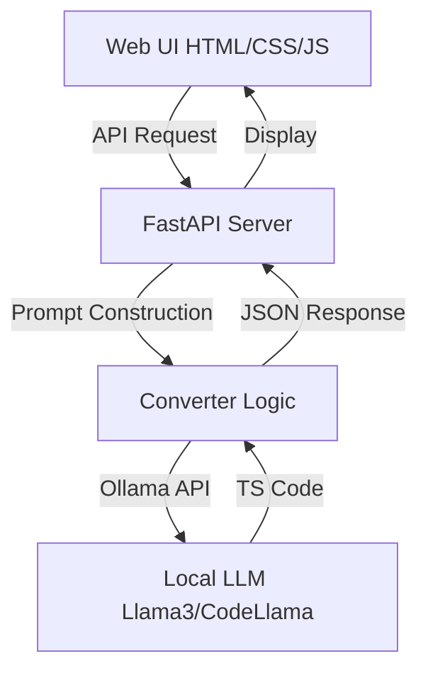

# 🚀 BlastConvert: Selenium to Playwright Migrator

BlastConvert is an AI-powered tool designed to streamline the migration of legacy Selenium (Java/TestNG) test automation code to modern Playwright (TypeScript). It leverages local LLMs via Ollama to ensure privacy, speed, and high-quality code generation.

## 🌟 Features

- **Premium Web Interface**: A modern, glassmorphic dark-mode UI for a seamless experience.
- **Dual-Pane Comparison**: View your original Java code and the converted TypeScript side-by-side.
- **Local AI Powered**: Integrated with Ollama to use models like Llama 3, Mistral, or CodeLlama locally.
- **Dynamic Model Detection**: Automatically detects and lets you choose from models available on your machine.
- **Smart Mapping**: Specifically tuned to convert TestNG annotations and common Selenium WebDriver patterns to idiomatic Playwright.
- **One-Click Actions**: Syntax highlighting, "Copy to Clipboard", and "Download Converted File".

## 📐 Architecture

The project follows the **B.L.A.S.T Protocol** and a deterministic 3-layer architecture:



## 📂 Project Structure

- `tools/`: Python backend scripts (FastAPI server and Ollama client).
- `ui/`: Frontend assets (HTML, CSS, and Vanilla JS).
- `architecture/`: Documentation for conversion mapping and API specifications.
- `run.sh`: Convenient startup script for the entire application.

## 🛠️ Prerequisites

1.  **Python 3.9+**
2.  **Ollama**: Installed and running on your machine.
3.  **Local Models**: Ensure you have pulled at least one code-capable model:
    ```bash
    ollama pull llama3.2:3b
    # or
    ollama pull codellama
    ```

## 🚀 Getting Started

1.  **Clone the Repository**:
    ```bash
    git clone https://github.com/rahultalwar/SeleniumToPlaywrightConverter.git
    cd SeleniumToPlaywrightConverter
    ```

2.  **Install Dependencies**:
    The system includes an environment verification script that installs missing packages:
    ```bash
    python3 tools/verify_env.py
    ```

3.  **Launch the Application**:
    ```bash
    ./run.sh
    ```

4.  **Access the Migrator**:
    Open [http://localhost:8000](http://localhost:8000) in your web browser.

## 📝 Usage

1.  Paste your Selenium Java code (including TestNG annotations) into the left pane.
2.  Select your desired local model from the dropdown.
3.  Click **"Convert Now"**.
4.  Review, copy, or download the generated Playwright TypeScript code from the right pane.

---
*Built with ❤️ by Antigravity using the B.L.A.S.T protocol.*
