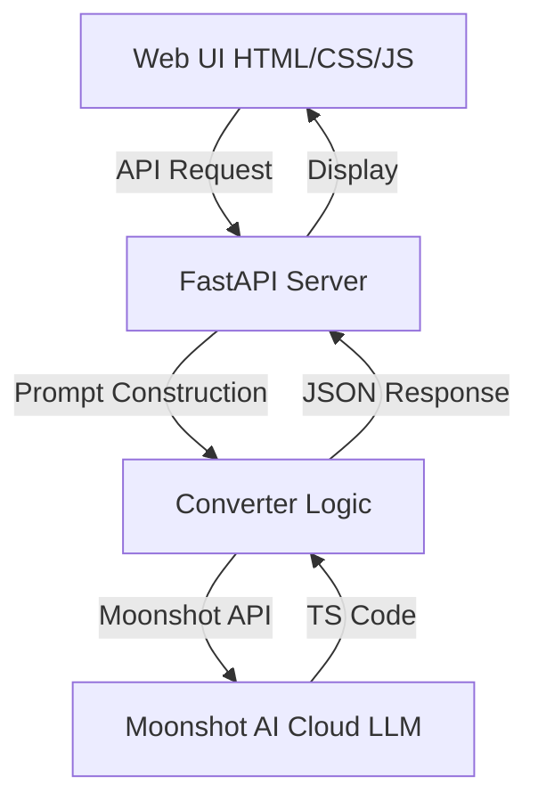

# 🚀 BlastConvert: Selenium to Playwright Migrator

BlastConvert is an AI-powered tool designed to streamline the migration of legacy Selenium (Java/TestNG) test automation code to modern Playwright (TypeScript). It leverages the **Moonshot AI (Kimi)** API for high-quality code generation with cloud-based LLM capabilities.

## 🌟 Features

- **Premium Web Interface**: A modern, glassmorphic dark-mode UI for a seamless experience.
- **Dual-Pane Comparison**: View your original Java code and the converted TypeScript side-by-side.
- **Moonshot AI Powered**: Integrated with Moonshot AI API for fast, high-quality code conversion.
- **Model Selection UI**: Choose from available Moonshot models (8K, 32K, 128K context windows) directly in the interface.
- **Smart Mapping**: Specifically tuned to convert TestNG annotations and common Selenium WebDriver patterns to idiomatic Playwright.
- **One-Click Actions**: Syntax highlighting, "Copy to Clipboard", and "Download Converted File".

## 📐 Architecture

The project follows the **B.L.A.S.T Protocol** and a deterministic 3-layer architecture:



## 📂 Project Structure

- `tools/`: Python backend scripts (FastAPI server and Moonshot API client).
- `ui/`: Frontend assets (HTML, CSS, and Vanilla JS).
- `architecture/`: Documentation for conversion mapping and API specifications.
- `run.sh`: Convenient startup script for the entire application.

## 🛠️ Prerequisites

1.  **Python 3.9+**
2.  **Moonshot API Key**: Sign up at [Moonshot AI](https://platform.moonshot.cn/) to get your API key.

## 🚀 Getting Started

1.  **Clone the Repository**:
    ```bash
    git clone https://github.com/rahultalwar/SeleniumToPlaywrightConverter.git
    cd SeleniumToPlaywrightConverter
    ```

2.  **Configure API Key**:
    Create a `.env` file in the project root:
    ```bash
    K2_API_KEY=your_moonshot_api_key_here
    ```
    Or copy the example file:
    ```bash
    cp .env.example .env
    # Edit .env with your actual API key
    ```

3.  **Install Dependencies**:
    The system includes an environment verification script that installs missing packages:
    ```bash
    python3 tools/verify_env.py
    ```

4.  **Launch the Application**:
    ```bash
    ./run.sh
    ```

5.  **Access the Migrator**:
    Open [http://localhost:8000](http://localhost:8000) in your web browser.

## 📝 Usage

1.  Paste your Selenium Java code (including TestNG annotations) into the left pane.
2.  **Select your desired Moonshot model** from the dropdown in the control center (8K, 32K, or 128K context window).
3.  Click **"Convert Now"**.
4.  Review, copy, or download the generated Playwright TypeScript code from the right pane.

### Model Selection

The UI provides a dropdown to select from available Moonshot models:

| Model | Context Window | Best For |
|-------|---------------|----------|
| `moonshot-v1-8k` | 8K tokens | Small to medium test files (default) |
| `moonshot-v1-32k` | 32K tokens | Large test suites |
| `moonshot-v1-128k` | 128K tokens | Very large codebases |

## ⚙️ Configuration Options

You can customize the Moonshot integration via environment variables in your `.env` file:

| Variable | Description | Default |
|----------|-------------|---------|
| `K2_API_KEY` | Your Moonshot API key | *required* |
| `K2_API_URL` | Moonshot API endpoint | `https://api.moonshot.cn/v1/chat/completions` |
| `K2_MODEL` | Default model if none selected | `moonshot-v1-8k` |

### Available Models
- `moonshot-v1-8k` (default) - 8K context window
- `moonshot-v1-32k` - 32K context window
- `moonshot-v1-128k` - 128K context window

---
*Built with ❤️ by Antigravity using the B.L.A.S.T protocol.*
